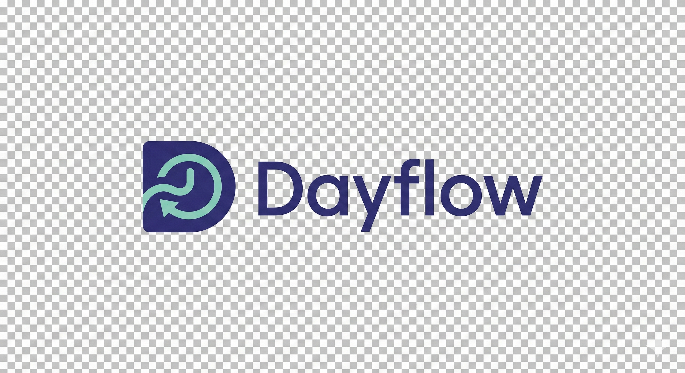

<div align="center">

# Dayflow - Human Resource Management System



### Every workday, perfectly aligned.

[](https://dayflow-workforce-odoo-gcet.vercel.app/)
[](https://opensource.org/licenses/MIT)

[](https://nodejs.org/)
[](https://reactjs.org/)
[](https://www.mongodb.com/)
[](https://expressjs.com/)

**[View Live Demo](https://dayflow-workforce-odoo-gcet.vercel.app/)** | **[API Documentation](#api-documentation)** | **[Screenshots](#screenshots)**

</div>

---

## Table of Contents

1. [About the Project](#about-the-project)
2. [Problem Statement](#problem-statement)
3. [Our Solution](#our-solution)
4. [Key Features](#key-features)
5. [Technology Stack](#technology-stack)
6. [System Architecture](#system-architecture)
7. [Screenshots](#screenshots)
8. [Installation Guide](#installation-guide)
9. [API Documentation](#api-documentation)
10. [Security Features](#security-features)
11. [Team](#team)

---

## About the Project

**Dayflow** is a modern, full-stack Human Resource Management System (HRMS) designed to digitize and automate core HR operations for organizations of all sizes. Built with Odoo-inspired design principles, Dayflow provides a centralized platform for managing employees, tracking attendance, processing leave requests, and maintaining payroll visibility.

### Live Demo

**Website:** [https://dayflow-workforce-odoo-gcet.vercel.app/](https://dayflow-workforce-odoo-gcet.vercel.app/)

---

## Problem Statement

Organizations today face significant challenges in HR management:

| Challenge | Impact |
|-----------|--------|
| Manual, paper-based HR processes | 40% time wasted on administrative tasks |
| Fragmented employee data | Poor decision-making, compliance risks |
| Inaccurate attendance tracking | Payroll errors, employee dissatisfaction |
| Opaque salary structures | Trust issues, high attrition |
| Weak access control | Security vulnerabilities, data breaches |

---

## Our Solution

Dayflow addresses these challenges through:

- **Centralized HR Operations** - Single platform for all HR activities
- **Automated Workflows** - Reduce manual intervention in routine tasks
- **Real-Time Analytics** - Data-driven insights for better decisions
- **Role-Based Security** - Granular access control (Admin, HR, Employee)
- **Multi-Company Support** - Complete data isolation between organizations
- **AI-Powered Assistant** - Intelligent chatbot using Groq LLaMA 3.3 70B

---

## Key Features

### Authentication & Authorization
- Secure organization registration with admin account creation
- JWT token-based authentication (30-day validity)
- Three-tier role system: Admin, HR, Employee
- Auto-generated employee codes (e.g., `DAOM20260001`)

### Employee Management
- Comprehensive employee profiles (personal, work, bank details)
- Searchable team directory with status indicators
- Excel export for reporting and compliance
- Full CRUD operations for administrators

### Attendance Tracking
- One-click check-in/check-out with timestamps
- Automatic work hours calculation
- Monthly attendance statistics
- Admin can edit and delete attendance records

### Leave Management
- Apply for Paid, Sick, or Unpaid leave
- Approval workflow for Admin/HR
- Automatic leave balance calculation (2 leaves/month)
- Real-time status tracking (Pending/Approved/Rejected)

### Payroll System
Smart salary auto-calculation with breakdown:

| Component | Calculation |
|-----------|-------------|
| Basic | 50% of Gross |
| HRA | 25% of Gross |
| Standard Allowance | Fixed 4,167 |
| Performance Bonus | 8.33% of Basic |
| Travel Allowance | 8.33% of Basic |
| PF Deduction | 12% of Basic |
| Professional Tax | Fixed 200 |

### AI Chatbot
- Powered by Groq LLaMA 3.3 70B
- Context-aware responses based on user profile
- HR-focused knowledge base
- Fallback engine for offline scenarios

### Dashboard & Announcements
- Key metrics: Attendance, Leave Balance, Pending Tasks
- Recent activity timeline
- Company-wide announcement system
- Real-time data synchronization

---

## Technology Stack

### Backend
| Technology | Version | Purpose |
|------------|---------|---------|
| Node.js | 22.x | Runtime Environment |
| Express.js | 5.x | Web Framework |
| MongoDB | 6.x | Database |
| Mongoose | 9.x | ODM |
| JWT | 9.x | Authentication |
| Bcrypt.js | 3.x | Password Hashing |
| Groq SDK | 0.37 | AI Integration |

### Frontend
| Technology | Version | Purpose |
|------------|---------|---------|
| React | 19.x | UI Library |
| Vite | 7.x | Build Tool |
| React Router | 7.x | Routing |
| Axios | 1.x | HTTP Client |
| Material-UI | 7.x | Component Library |
| Framer Motion | 12.x | Animations |
| Lucide React | 0.562 | Icons |

---

## System Architecture

```
+--------------------------------------------------+
|              CLIENT (React SPA)                   |
|  Dashboard | Employees | Leaves | Attendance     |
+--------------------------------------------------+
                      |
                      | HTTPS/REST API
                      v
+--------------------------------------------------+
|            API GATEWAY (Express.js)               |
|  Auth Middleware | Routes | Admin Middleware      |
+--------------------------------------------------+
                      |
                      v
+--------------------------------------------------+
|            BUSINESS LOGIC LAYER                   |
|  UserCtrl | AttendCtrl | LeaveCtrl | ChatCtrl    |
+--------------------------------------------------+
                      |
                      v
+--------------------------------------------------+
|              DATABASE (MongoDB)                   |
|  User Model | Attendance | Leave | Announcement  |
+--------------------------------------------------+
```

### Data Flow
1. Client sends HTTP request with JWT token
2. Auth Middleware validates token and extracts user
3. Controller processes business logic with company filtering
4. Model performs database operations
5. Response sent back to client as JSON

---

## Screenshots

> All screenshots are from the actual running application

### Landing Page

*Modern, professional landing page with clear value proposition*

---

### Authentication

| Login Page | Registration Page |
|:----------:|:-----------------:|
|  |  |

*Secure authentication with email/employee code login*

---

### Dashboard

**Admin Dashboard**

*Company-wide analytics, employee overview, and quick actions*

**Employee Dashboard**

*Personal metrics, attendance status, and announcements*

---

### Employee Management

**Employee Directory**

*Searchable grid with status indicators (Present/Leave/Absent)*

**Salary Management**

*Auto-calculated salary breakdown with editable components*

---

### Attendance & Leave

| Attendance Check-In | Leave Management |
|:-------------------:|:----------------:|
|  |  |

*One-click attendance and comprehensive leave application system*

---

### Backend API

*RESTful API with comprehensive endpoint documentation*

---

## Installation Guide

### Prerequisites
- Node.js v18 or higher
- MongoDB v6 or higher (local or Atlas)
- npm or yarn package manager

### Step 1: Clone Repository
```bash
git clone https://github.com/OMCHOKSI108/dayflow-workforce-odoo-gcet.git
cd dayflow-workforce-odoo-gcet
```

### Step 2: Backend Setup
```bash
cd backend
npm install
```

Create `.env` file:
```env
PORT=5000
MONGODB_URI=your_mongodb_connection_string
JWT_SECRET=your_secret_key
GROQ_API_KEY=your_groq_api_key
```

### Step 3: Frontend Setup
```bash
cd ../frontend
npm install
```

### Step 4: Run Application
```bash
# Terminal 1 - Backend
cd backend
npm run dev

# Terminal 2 - Frontend
cd frontend
npm run dev
```

### Access Points
- **Frontend:** http://localhost:5173
- **Backend API:** http://localhost:5000

---

## API Documentation

### Authentication
```
POST /api/users/login     - User login
POST /api/users           - Register organization
```

### User Management
```
GET    /api/users         - List all users (Admin)
POST   /api/users/create  - Create employee (Admin)
GET    /api/users/profile - Get own profile
PUT    /api/users/profile - Update own profile
GET    /api/users/:id     - Get user by ID (Admin)
PUT    /api/users/:id     - Update user (Admin)
DELETE /api/users/:id     - Delete user (Admin)
```

### Attendance
```
POST   /api/attendance/checkin  - Clock in
POST   /api/attendance/checkout - Clock out
GET    /api/attendance/my       - My attendance
GET    /api/attendance          - All attendance (Admin)
PUT    /api/attendance/:id      - Edit record (Admin)
DELETE /api/attendance/:id      - Delete record (Admin)
```

### Leaves
```
POST   /api/leaves      - Apply leave
GET    /api/leaves/my   - My leaves
GET    /api/leaves      - All leaves (Admin)
PUT    /api/leaves/:id  - Approve/Reject (Admin)
DELETE /api/leaves/:id  - Delete request
```

### Announcements
```
POST   /api/announcements     - Create (Admin/HR)
GET    /api/announcements     - Get all
PUT    /api/announcements/:id - Update (Admin/HR)
DELETE /api/announcements/:id - Delete (Admin/HR)
```

### AI Chat
```
POST /api/chat - Send message to AI assistant
```

Full documentation: [docs/backend_api.txt](docs/backend_api.txt)

Postman Collection: [docs/postman_api.json](docs/postman_api.json)

---

## Security Features

### Authentication
- JWT-based token authentication (30-day expiry)
- Bcrypt password hashing (10 salt rounds)
- Secure password validation (minimum 6 characters)

### Authorization
- Role-based access control (Admin, HR, Employee)
- Company-based data isolation
- Protected routes with middleware verification

### Data Protection
- Company-specific filtering on all queries
- Ownership verification before updates/deletes
- Prevention of role escalation attacks
- Input validation and sanitization

### API Security
- CORS protection with origin whitelist
- Rate limiting on sensitive endpoints
- NoSQL injection prevention via Mongoose
- XSS protection through React escaping

---

## Future Roadmap

| Phase | Features | Status |
|-------|----------|--------|
| v1.0 | Core HRMS + AI Chat | Complete |
| v1.1 | Task Management | Complete |
| v1.2 | Announcements System | Complete |
| v2.0 | Mobile App (React Native) | Planned |
| v2.1 | Biometric Integration | Planned |
| v2.2 | Advanced Analytics | Planned |
| v3.0 | Odoo ERP Integration | Planned |

---

## License

This project is licensed under the MIT License - see the [LICENSE](LICENSE) file for details.

---

## Acknowledgments

- **Odoo** - Design inspiration and philosophy
- **Groq** - AI model provider (LLaMA 3.3 70B)
- **MongoDB** - Database solution
- **Vercel** - Frontend hosting
- **Render** - Backend hosting

---

## Team

<div align="center">

### Built with dedication by Team Dayflow

| # | Name | Role |
|:-:|------|------|
| 1 | **Om Choksi** | Team Lead & Backend Developer |
| 2 | **Hari Patel** | Frontend Developer |
| 3 | **Dev Patel** | UI/UX & Database |
| 4 | **Brijesh Rakhasiya** | API Integration & Testing |

---

### Contact

**Email:** OMCHOKSI99@GMAIL.COM

**GitHub:** [OMCHOKSI108/dayflow-workforce-odoo-gcet](https://github.com/OMCHOKSI108/dayflow-workforce-odoo-gcet)

**Live Demo:** [https://dayflow-workforce-odoo-gcet.vercel.app/](https://dayflow-workforce-odoo-gcet.vercel.app/)

---

**Made with dedication for Odoo Hackathon 2026**

If you find this project useful, please consider giving it a star!

[Back to Top](#dayflow---human-resource-management-system)

</div>
